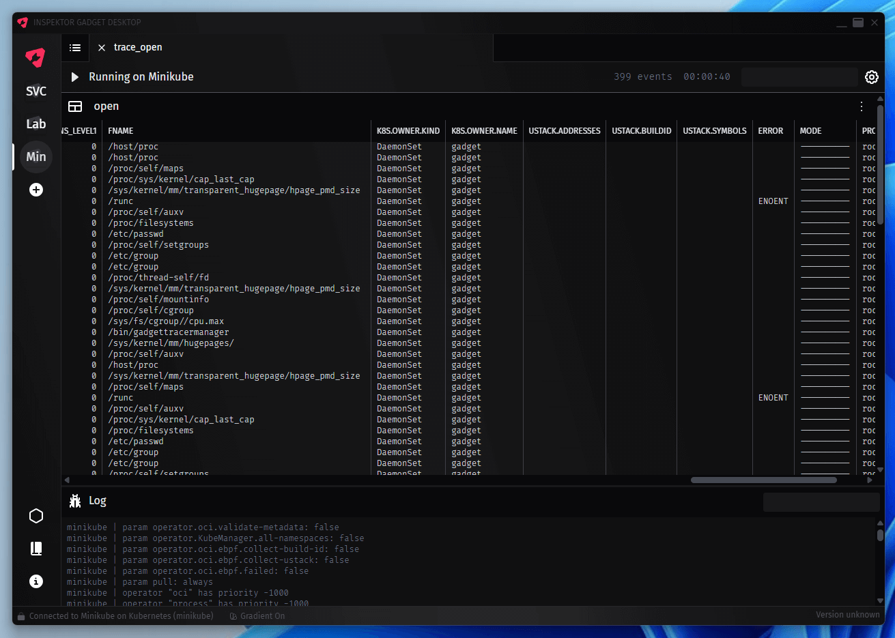

# Inspektor Gadget Desktop



## About

[Inspektor Gadget](https://inspektor-gadget.io) Desktop App bases on [wails](https://wails.io) and
[Svelte](https://svelte.dev). Available for Windows, Mac and Linux.

## Installation

### macOS

#### Homebrew Cask (Recommended)

```bash
brew install --cask inspektor-gadget/tap/ig-desktop
```

#### Manual Installation

Download the latest `.app.zip` file from the [releases page](https://github.com/inspektor-gadget/ig-desktop/releases), extract it, and move the app to your Applications folder.

### Windows

Download the latest `.exe` file from the [releases page](https://github.com/inspektor-gadget/ig-desktop/releases).

### Linux

Download the latest Linux binary from the [releases page](https://github.com/inspektor-gadget/ig-desktop/releases).

## Status

This project is in it's really early stages. Expect rough edges and bugs, but please let us know about them.
